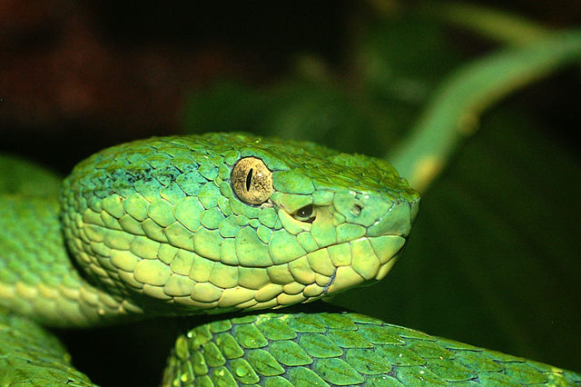
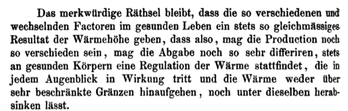

# 100 oren
--- ?image=benzinger.jpg&size=auto 75%&position=right
## oorthermometer
@div[left-50]
Thomas H. Benzinger 1905-1999  
Operatie Paperclip
@divend

note: benzinger was als fysioloog bij luchtmacht betrokken in oorlog, mgl betrokken bij onderkoelingsexperimenten. operatie paperclip project na WW2 om nazi geleerden naar VS te halen om technologie te delen. zo kwam benzinger in bethesda terecht, waar hij verder werkte aan temperatuur regulatie.
---
## oorthermometer
@div[left-50]
Bloedvaten trommelvlies zelfde als hypofyse  
Kerntemperatuur  
Infrarood  
Groefkopadders > eSnake
@divend

@div[right-50]

@divend

note: groefkopadders zijn ondersoort van adders (viperidae) die speciaal warmteorgaan hebben dat 0,003 graad K verschil kan detecteren. trefzekere beet in het donker (factor 10 gevoeliger dan wat mensen kunnen detecteren, en dat dan op afstand). gemedieerd door trpa1.
volgende thermometer zou e-snake kunnen zijn (analogie eNose)
---
## oorthermometer
Wijd toegepast
Geen evidence voor
Reviews pleiten tegen
Comfort based medicine
---
## temperatuur 
### 19e eeuw meets 21e eeuw
Carl August Wunderlich  
Normale temperatuur 37 graden
Variatie over de dag ± 0,5 graden
Ratselhaft

---
## invloed koptelefoon
